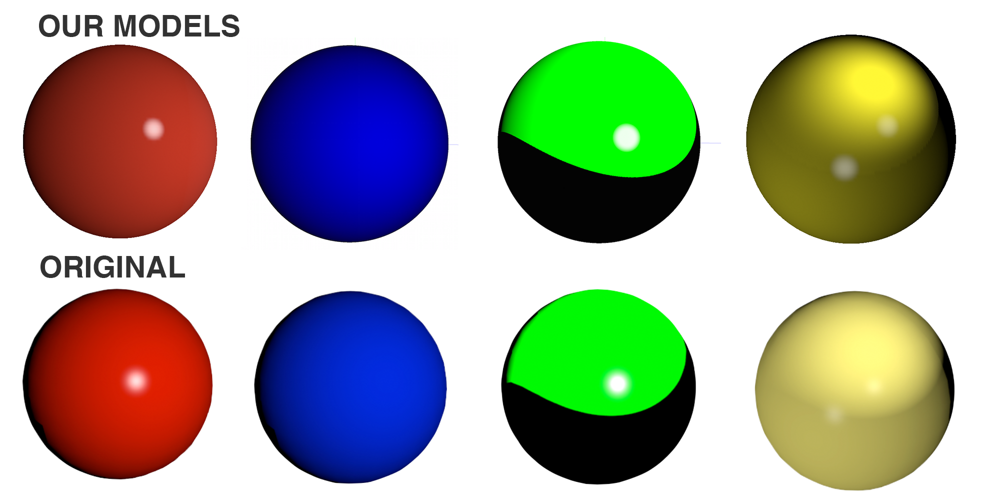
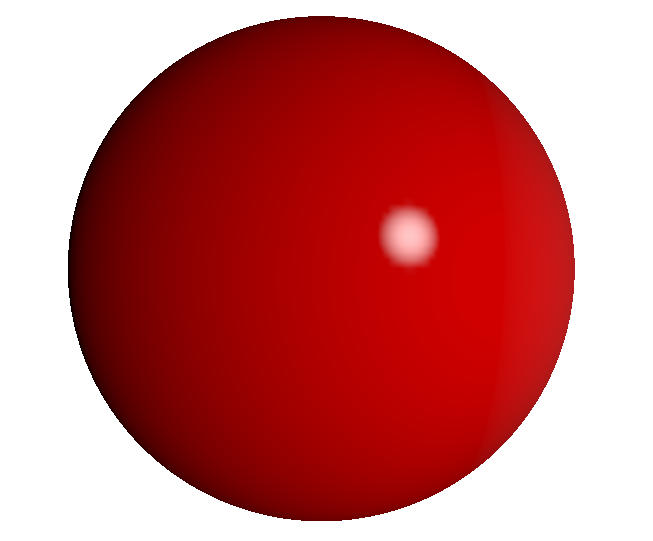
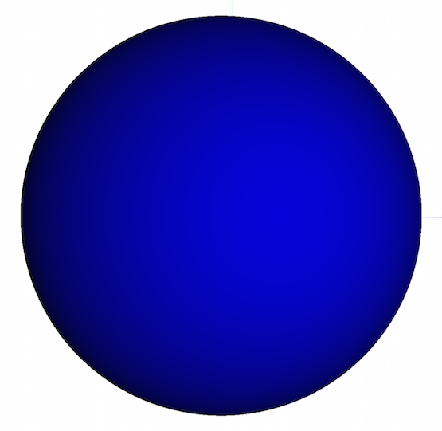
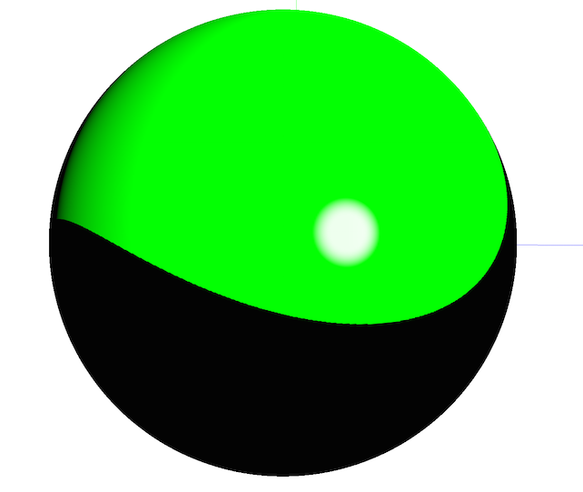
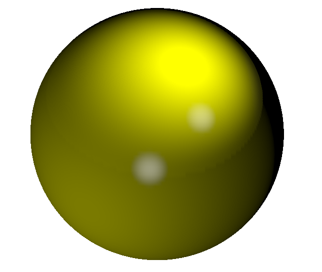

## Report

#### Red sphere, highlight on the surface of diffuse object

There are two lights in this sphere, one is the general light used to create the general color of the sphere and one spotlight.

The highlight in center of the red sphere can be implemented using spotlight, however, since the spot does not have clear edge, we have to smooth the edge using Hermite interpolation. Input of the interpolation is the angle of current vertex, based on the inner and outer angle, we interpolate a value between 0 and 1 and call it spoteffect, value of spoteffect is multiplied with sum of specular and diffuse color just like attenuation value.

The intensity of specular and ambient color in the spotlight is disable (assign 0) because we do not need them here, so the color comes from diffuse color and the interpolation of diffuse color.

The spot light has color white, to avoid passing more color, we use specular color of material (which we do not in this case and assign as white) as diffuse color of the spotlight.

The sphere is placed in the center and we always direct the light toward the center, so we try to change the position of the light to the right to create the shadow on the left.

#### Blue sphere, Diffuse surface, no highlights are visible

Normal, diffuse light is all that is necessary for this sphere. To avoid seeing any highlights, there is no specular light. Ambient light could be applied, but is not necessary. The blue is made more dull by reducing the diffuse coefficient, which is equivalent to reducing the blue RGB value.

The light position is 7 units in front of the face of the sphere in the image, just forward and to the right of the camera, so that the light is weighted torwards the bottom right. The diffuse light and attenuation coefficient of 0.025 shows this.

#### Green sphere, Spotlight with small highlight and sharp cutoff angle

This sphere is achieved by using two spotlights, one with green diffuse light, and one with white specular light.

For the diffuse spotlight, the hard cutoff angle is achieved by using no attenuation or smoothing. The trick to getting the abnormal shape as well as the shading on the left side is to direct the light cone partially off of the sphere. The light position is moved to the right of the camera so that we are seeing some of the light as it fades off on the back side of the sphere. This is the same concept as us seeing some sunlight when the sun falls behind Earth.

The highlight is from the other specular spotlight which is positioned behind the camera with an angle of 5 degrees. It combines specular and diffuse light with an attenuation coefficient of .02. To obtain a highlight that appears more "concentrated", the inner angle is only 4.5, resulting in smoothing over the .5 degrees.

#### Yellow sphere, little highlight and smooth cutoff angle

There are four lights in this sphere, one is the general light, two spotlight lights to create the blur little highlight and one spotlight to create the big smooth cutoff light.

The fourth light does not have a circle shape on the sphere so we have to change direction and position of the spotlight a lot of time until get a good enough one like int the image above.

We also add 0.003 into the interpolation value of the fourth light to make it more distinct with the background on the sphere. 
